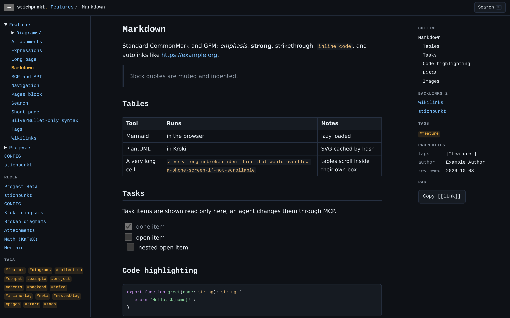
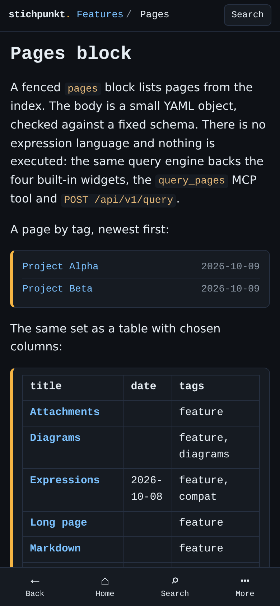

<div align="center">

<picture>
  <source media="(prefers-color-scheme: dark)" srcset="docs/assets/logo-dark.svg">
  
</picture>

**Notes that stay in order.**

A fast, minimal, self-hosted markdown wiki. Plain `.md` files are the database — agents write through MCP, you read.

[](https://github.com/ssalentin/stichpunkt/actions/workflows/ci.yml)
[](LICENSE)
[](https://nodejs.org)
[](https://svelte.dev)
[](https://www.typescriptlang.org)
[](https://modelcontextprotocol.io)
[](compose.yml)
[](#features)

[Quickstart](#quickstart) · [Features](#features) · [Configuration](#configuration) · [API & MCP](#api--mcp) · [Architecture](#architecture) · [Development](#development)

</div>

---

## Table of contents

- [What is stichpunkt?](#what-is-stichpunkt)
- [Demo](#demo)
- [Features](#features)
- [Screenshots](#screenshots)
- [Quickstart](#quickstart)
- [Usage](#usage)
- [Configuration](#configuration)
- [API & MCP](#api--mcp)
- [Operations](#operations)
- [Architecture](#architecture)
- [Development](#development)
- [Contributing](#contributing)
- [License](#license)

## What is stichpunkt?

*Stichpunkt* is German for "bullet point". It is a small wiki server built around one idea: **your knowledge base is just a directory of markdown files**. The server renders those files to a fast, mobile-first reading UI, keeps an in-memory index for search, tags and backlinks, and exposes the same operations over a REST API and an [MCP](https://modelcontextprotocol.io) server.

The web UI is deliberately **read-only**. Changes are made by agents (or scripts) writing through MCP or the token-protected REST API, so humans get a clean reading experience and agents get a safe, conflict-aware write path. Because the files are plain markdown, you can still edit, sync, grep and back them up with any tool you like.

## Demo

A public demo runs at **https://stichpunkt.salen7in.de**. It follows the latest commit on `main` and is redeployed automatically a few minutes after each push.

- The demo uses **example content only** (the `examples/knowledge` folder). Do not enter real or personal data.
- The demo is **not connected** to any production instance or knowledge base. Its write API is closed: the access token is generated at each start and never stored, so agents cannot write to it.
- The demo space is a copy of the example folder on the host. To reset it, restore that copy and restart the container.

## Features

**Reading experience**

- Folders are namespaces (`Server/SilverBullet.md` → page `Server/SilverBullet`); `Library/` is hidden from navigation.
- CommonMark + GFM, frontmatter, `[[Page]]`, `[[Page|alias]]`, `[[Page#Heading]]` wikilinks, `#tags` (inline and frontmatter) and syntax-highlighted code.
- Mobile-first shell (bottom bar and sheet), three columns on desktop, quick switcher (<kbd>Ctrl</kbd>/<kbd>⌘</kbd>+<kbd>K</kbd>), breadcrumbs, outline, backlinks and a properties rail.
- Callouts (`> [!note]`, `[!tip]`, `[!warning]`, … with `+`/`-` for foldable ones), footnotes (`[^1]`), emoji shortcodes (`:tada:`) and transclusion (`![[Page]]`, `![[Page#Heading]]`, nested up to 3 levels with a loop guard); see the `Features/` demo pages.
- Full-text search with ranked result cards, anchors, highlighted snippets and folder/tag facets (`#tag`, `in:folder`, `"phrases"`).
- Automatic `/tag/<name>` pages; tag metadata can be declared in `CONFIG.md` with `tag.define` (parsed, never executed).
- Installable PWA (Chrome on Android: "Install" button in the header or menu → *Install app*); the service worker caches the shell and the last ~50 visited pages for offline reading and shows an offline page for anything not yet visited. Installing requires HTTPS (or `localhost`).

**Themes**

- A selector in the header offers Light, Dark and System (default; follows the OS preference). The choice is stored in the browser (`localStorage`) and applied before first paint, so there is no flash on reload.
- All colours are CSS variables in `src/app.css`; adding another theme means adding one `:root[data-theme='…']` block.

**Diagrams**

- Client-side and lazy: Mermaid, Vega-Lite, KaTeX.
- Server-side via [Kroki](https://kroki.io) (SVG cached by hash): PlantUML, C4-PlantUML, Graphviz, D2, ERD, Nomnoml, Svgbob, Ditaa.
- A placeholder holds the space until the figure is ready; broken diagrams show the error and the source.

**Declarative queries**

- A fenced ` ```pages ` block with a small YAML body lists pages from the index: filters `tag`, `folder`, `links-to`; `sort` by `title`, `modified`, `date` or any frontmatter key; `show` as `list`, `table` or `count`; `limit` defaults to 50 (max 200).
- Strictly validated (js-yaml CORE + zod) — no expressions, no regex, nothing executed. The same engine backs the `${...}` expressions, the `query_pages` MCP tool and `POST /api/v1/query`.

**Expressions**

- `${ ausdruck }` is evaluated by a small, own expression language: a Pratt parser and tree-walking evaluator written in TypeScript, with no `eval`, no Lua and no JavaScript runtime.
- Server-side and read-only: literals, arithmetic and comparison, `and`/`or`/`not`, `??` and `?:`, field access and a fixed whitelist of builtins (`pages`, `count`, `page`, `sum`/`min`/`max`/`avg`, `len`, `join`, `lower`/`upper`, `round`, `today`/`date`/`days`/`fmt_date`, `link`). Records are `Map`s, so there is no JS property lookup.
- Strict limits: 500 characters, 50 expressions, AST depth 32, a 10000-step budget, 20 engine queries per page and 10000-character strings. Output is always escaped.
- An unreadable body stays a quiet chip; a runtime failure becomes a red chip with the message and the source.

**SilverBullet compatibility**

- SilverBullet-only syntax (`space-lua`, `space-style`, `query`, `template`) renders as an inert chip and is never executed.
- The four known `${kb.*}` helper calls (`kb.section`, `kb.recent`, `kb.header`, `kb.categories`) are recognised before the expression grammar and rendered as built-in server-side widgets. Every other `${...}` in the old Lua style stays an inert chip.

**Agent-friendly writes**

- MCP tools and REST endpoints for search, read, write, append, delete, expression evaluation and attachment upload.
- Optimistic concurrency via content hash (`base_hash`, **409** on conflict) and per-file write serialisation.
- Path safety: `..`, absolute paths, backslashes, dot-files and symlinks leaving `SPACE_DIR` are rejected.

## Screenshots

<p align="center">
  
</p>

<p align="center">
  
</p>

_Screenshots show the bundled [`examples/knowledge/`](examples/knowledge) space (dark theme). See [Development](#development) to run it yourself._

## Quickstart

Requires Docker with Compose. (Without Docker you need Node.js ≥ 22.)

```sh
git clone https://github.com/ssalentin/stichpunkt.git
cd stichpunkt

cp .env.example .env             # set MDWIKI_API_TOKEN (openssl rand -base64 32)
mkdir space                      # or copy your markdown directory here
STICHPUNKT_COMMIT=$(git rev-parse HEAD) docker compose up -d --build
```

The footer shows the app version and the commit the build comes from. The Docker build has no `.git`, so pass the commit as shown; without it the footer says `unknown`.

The sample [`compose.yml`](compose.yml) starts stichpunkt (port 3000 inside the container) and an internal Kroki container for server-side diagrams. **It does not publish a port** — put your reverse proxy in front (see [Reverse-proxy contract](#reverse-proxy-contract)).

Without Docker:

```sh
npm ci && npm run build
SPACE_DIR=./space MDWIKI_API_TOKEN=… node build/index.js
```

## Usage

**Read** — open the site through your proxy. Browse by folder, search, or press <kbd>Ctrl</kbd>/<kbd>⌘</kbd>+<kbd>K</kbd> for the quick switcher.

**Write from an agent** — register the MCP server, for example with Claude Code:

```sh
claude mcp add --transport http stichpunkt https://stichpunkt.example.org/mcp \
  --header "Authorization: Bearer $MDWIKI_API_TOKEN"
```

**Write from a script** — use the REST API:

```sh
curl -X PUT https://stichpunkt.example.org/api/v1/pages/Notes/Hello \
  -H "Authorization: Bearer $MDWIKI_API_TOKEN" \
  -H "Content-Type: application/json" \
  -d '{"content": "# Hello\n\nA first note #demo", "base_hash": ""}'
```

`base_hash: ""` means "the page must not exist yet".

**Query pages from markdown** — put this in any page:

````md
```pages
tag: project
sort: modified desc
show: table
columns: [title, status]
limit: 20
```
````

## Configuration

Set via environment variables (see [`.env.example`](.env.example)).

| Variable | Default | Meaning |
| --- | --- | --- |
| `SPACE_DIR` | `./space` (`/space` in the image) | markdown directory |
| `MDWIKI_API_TOKEN` | – | bearer token for `/mcp` and `/api`; **at least 32 characters; empty, shorter or `change-me` = both always answer 401** (a startup error is logged). `openssl rand -base64 32` gives 44 |
| `KROKI_URL` | empty | internal Kroki base URL; empty disables server-side diagrams (they show an error block) |
| `POLL_INTERVAL` | `10000` | ms between mtime polls for changes made outside the app (CIFS has no reliable inotify) |
| `MAX_WRITE_BYTES` | `1048576` | max size of a page write |
| `MAX_UPLOAD_BYTES` | `20971520` | max size of an attachment |
| `CACHE_DIR` | system temp (`/cache` in the image) | rendered diagram SVGs |
| `BODY_SIZE_LIMIT` | `25M` (image) | adapter-node request body limit; keep ≥ `MAX_UPLOAD_BYTES` |
| `PORT`, `HOST`, `PROTOCOL_HEADER`, `HOST_HEADER` | | adapter-node settings |

Allowed file extensions (read/write/upload): `md txt csv json pdf png jpg jpeg gif webp avif heic svg`.

The display name, tagline and brand palette live in one place: [`src/lib/brand.ts`](src/lib/brand.ts).

> **Naming note:** the project was renamed to `stichpunkt`, except for `MDWIKI_API_TOKEN`, the `X-Mdwiki-Zone` proxy header and the npm package name, which keep the old id as an internal contract.

### Reverse-proxy contract

The app serves plain HTTP; TLS is terminated by the proxy, so set `PROTOCOL_HEADER=x-forwarded-proto` and `HOST_HEADER=x-forwarded-host`, otherwise SvelteKit assumes `https` for generated URLs.

The web UI has **no login of its own**, so two routers are needed:

| Router | Paths | Auth | `X-Mdwiki-Zone` |
| --- | --- | --- | --- |
| UI | everything else | your SSO (e.g. Authelia) | **must not set** |
| Machine | `/mcp`, `/api` (see rule below) | bearer token | **must set `machine`** (overwriting any client value) |

Match the machine router with ``Path(`/mcp`) || PathPrefix(`/mcp/`) || Path(`/api`) || PathPrefix(`/api/`)``, not a bare ``PathPrefix(`/api`)``, which is a plain string match and also catches `/apix` and `/mcp-foo`.

With the header present, the app requires the token for *every* path on that request. This closes path tricks like `/api/%2e%2e/_ui/page`, which a proxy matching the raw path could otherwise forward as `/_ui/page`. In Traefik, use a `headers` middleware with `customRequestHeaders`.

## API & MCP

All routes require `Authorization: Bearer <token>`. Page names are paths without `.md`.

| Method and path | Purpose |
| --- | --- |
| `GET /api/v1/search?q=&limit=` | full-text search |
| `GET /api/v1/pages?prefix=` | list pages |
| `GET /api/v1/pages/<path>` | `{content, frontmatter, hash, mtime}` |
| `PUT /api/v1/pages/<path>` | `{content, base_hash?}`; stale `base_hash` → **409** with `current`; `base_hash: ""` = must not exist |
| `POST /api/v1/pages/<path>` | `{content}` append |
| `DELETE /api/v1/pages/<path>` | delete |
| `GET /api/v1/tags`, `GET /api/v1/tags/<name>` | tags, pages by tag |
| `GET /api/v1/backlinks/<path>` | backlinks |
| `POST /api/v1/query` | run a `pages` query (`{tag?, folder?, links-to?, sort?, limit?, show?, columns?, self?}`) |
| `PUT /api/v1/attachments/<path>` | raw body upload, any allowed type |

**MCP** (`POST /mcp`, Streamable HTTP, stateless) tools: `search`, `list_pages`, `read_page`, `write_page`, `append_to_page`, `delete_page`, `list_tags`, `pages_by_tag`, `get_backlinks`, `query_pages`, `evaluate`, `upload_attachment`.

## Operations

**Token rotation**

1. Generate a new token: `openssl rand -base64 32`; store it in your password manager.
2. Put it into `.env` as `MDWIKI_API_TOKEN`.
3. `docker compose up -d stichpunkt` (recreates the container; the web UI is unaffected).
4. Update the clients (agent runtimes, `claude mcp add … --header`). The old token stops working immediately.

**Stopping**

- `docker compose stop` — keep containers.
- `docker compose down` — remove containers; `space/` is a bind mount and is never touched.
- `docker compose down -v` — also drops the diagram cache volume.

## Architecture

```text
 browser ──► UI proxy router (SSO) ───────┐
                                          ▼
 agents  ──► machine router (bearer) ──► stichpunkt (SvelteKit, adapter-node)
              + X-Mdwiki-Zone: machine     │   ├─ web UI      src/routes
                                           │   ├─ REST API    src/routes/api/v1
                                           │   ├─ MCP server  src/routes/mcp
                                           │   └─ in-memory index (pages, tags, backlinks, search)
                                           │
                       ┌───────────────────┼────────────────────┐
                       ▼                   ▼                    ▼
                  SPACE_DIR (*.md)    CACHE_DIR (SVG)     Kroki (internal)
```

- **Files are the source of truth.** The index is rebuilt in memory and refreshed by polling mtimes, so edits made outside the app show up too.
- **One service layer, three front doors.** The UI, REST API and MCP tools share the same operations (`src/lib/server/service.ts`).
- **Server code** lives in `src/lib/server/` (store, markdown rendering, `pages` query engine, auth, path safety, Kroki client, MCP); diagram handling is behind one registry in `src/lib/diagrams.ts`.
- **Single container**, plus an internal-only Kroki container that is never exposed to the internet.

## Development

```sh
npm ci
npm test            # vitest: renderer, index, polling, conflicts, path safety, auth, MCP
npm run check       # svelte-check
npm run build
npm run dev         # vite dev server
```

Try every feature against the example space (set `KROKI_URL` for server-side diagrams):

```sh
SPACE_DIR=examples/knowledge node build/index.js
```

Test fixtures live in `test/fixtures/space` (synthetic, no real content).

**Things to know**

- Writes inside one process are serialised per file; optimistic concurrency via content hash protects against *other* writers, but the check-then-rename window against an external process writing at the same instant cannot be closed on a plain directory.
- Page names starting with `api` or `mcp` as the first segment are not reachable through the UI (those prefixes are reserved for the token-protected interfaces).

## Contributing

See [CONTRIBUTING.md](CONTRIBUTING.md). All GitHub text (PRs, issues, comments, commits, branch names, code comments) is in English.

## License

[MIT](LICENSE) © 2026 the stichpunkt authors
