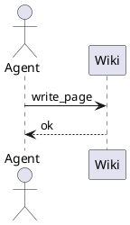
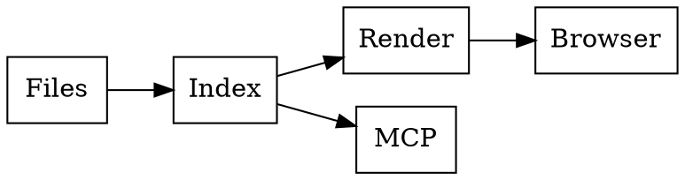

# Kroki diagrams

## PlantUML



## C4-PlantUML

```c4plantuml
@startuml
!include <C4/C4_Context>
Person(user, "Reader", "Reads on a phone")
System(wiki, "stichpunkt", "Read-only markdown wiki")
System_Ext(agent, "Agent", "Writes via MCP")
Rel(user, wiki, "reads")
Rel(agent, wiki, "writes")
@enduml
```

## Graphviz



## D2

```d2
reader -> wiki: reads
agent -> wiki: writes via MCP
wiki -> files
```

## ERD

```erd
[Page]
*path
title
[Tag]
*name
[Page_Tag]
*page
*tag
Page 1--* Page_Tag
Tag 1--* Page_Tag
```

## Nomnoml

```nomnoml
[Agent] -> [MCP server]
[MCP server] -> [Service layer]
[REST API] -> [Service layer]
[Service layer] -> [Files]
```

## Svgbob

```svgbob
 .-----.      .------.
 | App |----->| Disk |
 '-----'      '------'
```

## Ditaa

```ditaa
+--------+   +---------+
| Agent  |-->| stichpunkt |
+--------+   +---------+
```
