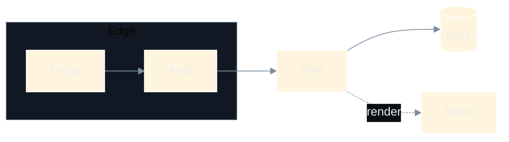
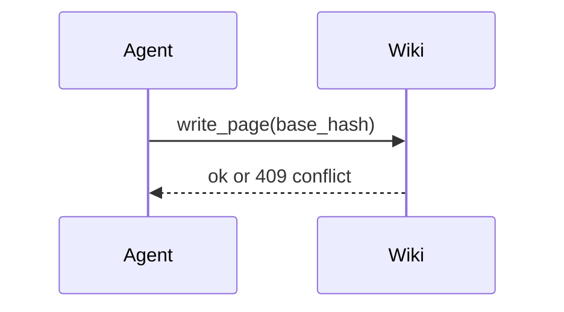

# Mermaid

The `%%{init}%%` directive below is the dark palette used by the real notes; it is respected. Mermaid diagrams sit on a dark panel in both themes.

Without an init directive the dark default theme applies:

