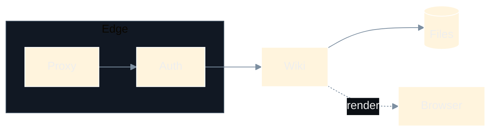
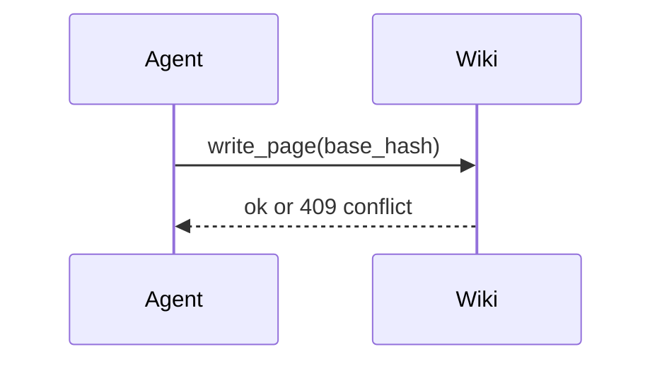

# Mermaid

The `%%{init}%%` directive below is respected. Mermaid diagrams otherwise follow Stichpunkt's active theme.

```mermaid
%%{init: {"theme":"base","themeVariables":{"darkMode":true,"lineColor":"#7d8fa1","textColor":"#dbe4ec","edgeLabelBackground":"#0b0f14","clusterBkg":"#111823","clusterBorder":"#3a4a5a","fontSize":"15px"}}}%%
flowchart LR
  subgraph edge[Edge]
    P[Proxy] --> A[Auth]
  end
  A --> W[Wiki]
  W --> K[(Files)]
  W -. render .-> D[Browser]
```

Without an init directive the site theme applies:

```mermaid
sequenceDiagram
  participant Agent
  participant Wiki
  Agent->>Wiki: write_page(base_hash)
  Wiki-->>Agent: ok or 409 conflict
```
