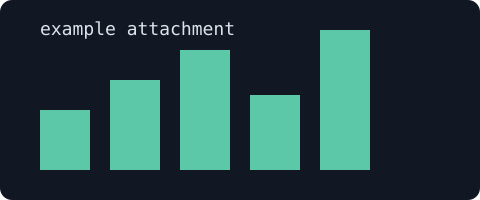

# Markdown

Standard CommonMark and GFM: *emphasis*, **strong**, ~~strikethrough~~, `inline code`, and autolinks like https://example.org.

> Block quotes are muted and indented.

## Tables

| Tool | Runs | Notes |
| --- | --- | --- |
| Mermaid | in the browser | lazy loaded |
| PlantUML | in Kroki | SVG cached by hash |
| A very long cell | `a-very-long-unbroken-identifier-that-would-overflow-a-phone-screen-if-not-scrollable` | tables scroll inside their own box |

## Tasks

Task items are shown read only here; an agent changes them through MCP.

- [x] done item
- [ ] open item
  - [ ] nested open item

## Code highlighting

```ts
export function greet(name: string): string {
  return `Hello, ${name}!`;
}
```

```python
def fib(n):
    return n if n < 2 else fib(n - 1) + fib(n - 2)
```

```bash
docker compose up -d --build && curl -s localhost:3000/ | head
```

```yaml
services:
  app:
    image: example/app:1.0
```

```json
{ "name": "stichpunkt", "readOnly": true }
```

## Lists

1. First
2. Second
   - nested bullet
   - another

## Images


