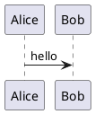
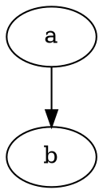

# Syntax

Text with a tag #syntax-test and a `[[not a link]]` in code, and #123 is not a tag.

| a | b |
|---|---|
| 1 | 2 |

~~strike~~ and https://example.org autolink.

```ts
const x: number = 1;
```

```space-lua
print("never executed")
```

```query
page where tags = "x"
```

Inline expression ${1 + 1} stays inert.

Inline math $a^2 + b^2 = c^2$ and price $5 stays text.

$$
\int_0^1 x\,dx = \tfrac12
$$


```vega-lite
{"data":{"values":[{"x":"a","y":3},{"x":"b","y":5}]},"mark":"bar","encoding":{"x":{"field":"x","type":"nominal"},"y":{"field":"y","type":"quantitative"}}}
```





```d2
x -> y
```

```plantuml
@startuml
this is not valid plantuml
